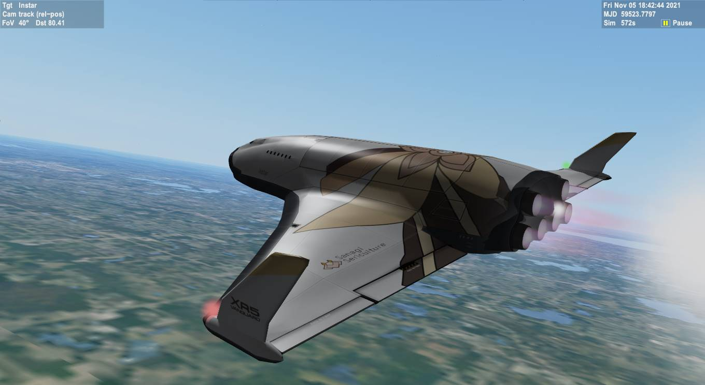

# Sanagi Sericulture XR5 Vanguard Skin Add-on for Orbiter

> *An excerpt from Vtuber Style magazine, November 6, 2121:*
> 
> ## Sanagi Yuzu Aims For The Stars!
>
> 
> 
> Great news for the fans of Sanagi Yuzu that live off Earth --
> now they too can receive their shipment of her high-quality silk!
> 
> After three months of negotiations with Altea Aerospace and other companies,
> Yuzu's private silk production company Sanagi Sericulture
> finally expands its scope of operation to space!
> The first spaceship that will handle the interplanetary cargo deliveries,
> the *Instar*, takes off on its maiden flight on the 7th of November, carrying
> a full cargo bay of silk to the Moon.
> 
> The *Instar* spacecraft is an XR5 Vanguard vessel engineered by Altea Aerospace,
> designed for interplanetary cargo hauls. With its maximum payload mass
> amounting to 432000 kg, 8524 kN of total main engine thrust (in vacuum)
> and 230880 kg of main engine fuel, Vanguard is able to deliver high amounts of cargo
> to Moon, Mars and other celestial bodies of the inner Solar System.

## Description

This is an add-on for [Orbiter Space Flight Simulator]
that contains a skin for the XR5 Vanguard spacecraft by [Altea Aerospace],
themed after Sanagi Sericulture, a fictional private corporation owned by [Sanagi Yuzu].
Additionally, the add-on also contains a custom payload module for the Vanguard.

## Screenshots

## Installation

1. Download the latest version of the add-on from the [Releases] section.
2. Unpack the archive in your Orbiter installation folder.

## Authors

- cafune and chill (Discord: *CafuneAndChill#3083*)

[Orbiter Space Flight Simulator]: http://orbit.medphys.ucl.ac.uk/
[Altea Aerospace]: https://alteaaerospace.com/
[Sanagi Yuzu]: https://twitter.com/SanagiYuzu
[Releases]: "to-do"